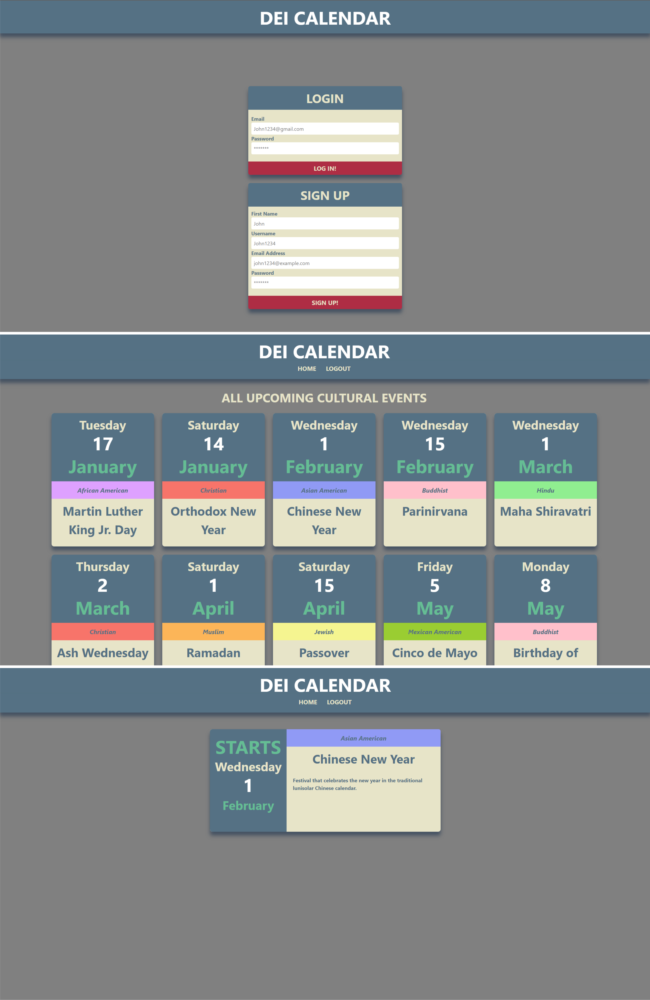

# DEI Calendar 

## Description

DEI Calendar is a place for employees to learn about upcoming cultural festivals and holidays to enable them to connect with each other to plan for celebrations. 
Employees / Users will be able to express their interest in participating in an event or celebration. 

## Technologies Used
* React
* Express.js
* Mongoose
* Node.js

## Screenshot

## Link to Deployed Site
https://serene-mesa-60189.herokuapp.com/

## Contributors
* Gary Williams
* Megan Gedde
* Omar Wright
* Peter Hodnefield
* Vani Karun
* Brynn Kiloran
